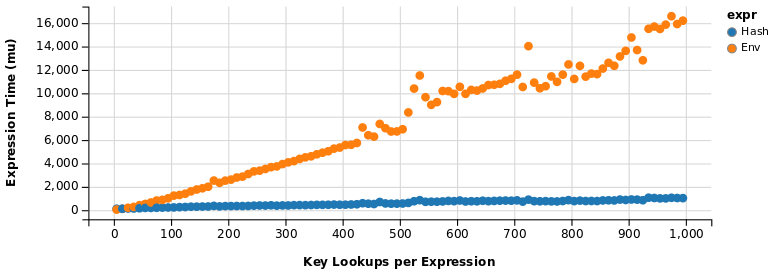
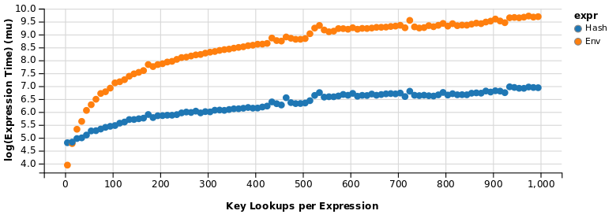

<!-- README.md is generated from README.Rmd. Please edit that file -->

```{r, echo = FALSE}
knitr::opts_chunk$set(
  collapse = TRUE,
  comment = "#>",
  fig.path = "README-"
)
```

hashmap 
=======

[](https://travis-ci.org/nathan-russell/hashmap) 
[](./LICENSE) 
[](https://cran.r-project.org/package=hashmap) 


### Motivation 

Unlike many programming languages, R does not implement a native hash table 
class. The typical workaround is to use `environment`s, taking advantage of 
the fact that these objects are, by default, internally hashed: 

```R
EE <- new.env(hash = TRUE)  # equivalent to new.env()

set.seed(123)
list2env(
    setNames(
        as.list(rnorm(26)), 
        LETTERS
    ),
    envir = EE
)

EE[["A"]]
# [1] -0.5604756

EE[["D"]]
# [1] 0.07050839

EE[["Z"]]
# [1] -1.686693
```

In many situations, this is a fine solution - lookups are reasonably 
fast, and `environment`s are highly flexible, allowing one to store 
virtually any type of R object (functions, lists, other environments, etc.).
However, one of the major downsides to using `envinronment`s as hash tables 
is the inability to work with vector arguments: 

```R
EE[[c("A", "B")]]
# Error in EE[[c("A", "B")]] : 
#   wrong arguments for subsetting an environment

EE[c("A", "B")]
# Error in EE[c("A", "B")] : 
#   object of type 'environment' is not subsettable
```

This is unfortunate, and somewhat surprising, considering most 
operations in R have vectorized semantics. 

------------

### Solution 

```R
library(hashmap)

set.seed(123)
(HH <- hashmap(LETTERS, rnorm(26)))
## (character) => (numeric)  
##         [Z] => [-1.686693]
##         [Y] => [-0.625039]
##         [R] => [-1.966617]
##         [X] => [-0.728891]
##         [Q] => [+0.497850]
##         [P] => [+1.786913]
##       [...] => [...] 

HH[[c("A", "B")]]
# [1] -0.5604756 -0.2301775
```

It is important to note that unlike the `environment`-based solution, 
`hashmap` does *NOT* offer the flexibility to store arbitrary types of 
objects. Any combination of the following *atomic* vector types is 
currently permitted: 

+ keys
    + `integer`
    + `numeric`
    + `character`
    + `Date` 
    + `POSIXct`
+ values
    + `logical`
    + `integer`
    + `numeric`
    + `character`
    + `complex`
    + `Date`
    + `POSIXct`

------------

### Features 

What `hashmap` may lack in terms of flexibility it makes up for in 
two important areas: performance and ease-of-use. Let's begin with the 
latter by looking at some basic examples. 

#### Usage

+ A `Hashmap` is created by passing a vector of keys and a vector of 
values to `hashmap`: 

    ```R
    set.seed(123)
    H <- hashmap(letters[1:10], rnorm(10))
    H
    ## (character) => (numeric)  
    ##         [j] => [-0.445662]
    ##         [i] => [-0.686853]
    ##         [h] => [-1.265061]
    ##         [g] => [+0.460916]
    ##         [e] => [+0.129288]
    ##         [d] => [+0.070508]
    ##       [...] => [...] 
    ```

+ If the lengths of the two vectors are not equal, the longer object is 
truncated to the length of its counterpart, and a warning is issued: 

    ```R
    hashmap(letters[1:5], 1:3)
    ## (character) => (integer)
    ##         [c] => [3]      
    ##         [b] => [2]      
    ##         [a] => [1]      
    # Warning message:
    # In new_CppObject_xp(fields$.module, fields$.pointer, ...) :
    #   length(keys) != length(values)!
      
    hashmap(letters[1:3], 1:5)
    ## (character) => (integer)
    ##         [c] => [3]      
    ##         [b] => [2]      
    ##         [a] => [1]      
    # Warning message:
    # In new_CppObject_xp(fields$.module, fields$.pointer, ...) :
    #   length(keys) != length(values)!
    ```
    
+ Value lookup can be performed by passing a vector of lookup keys to 
either of `[[` or `$find`: 

    ```R
    H[["a"]]
    # [1] -0.5604756
    
    H$find("b")
    # [1] -0.2301775
    
    H[[c("a", "c")]]
    # [1] -0.5604756  1.5587083
    
    H$find(c("b", "d"))
    # [1] -0.23017749  0.07050839
    ```

+ For non-existent lookup keys, `NA` is returned: 

    ```R
    H[[c("a", "A", "b")]]
    # [1] -0.5604756         NA -0.2301775
    ```
    
+ Use `$has_key` to check for the existence of individual keys, or `$has_keys` 
for a vector of keys: 

    ```R
    H$has_key("a")
    # [1] TRUE
    
    H$has_key("A")
    # [1] FALSE
    
    H$has_keys(c("a", "A", "b", "B"))
    # [1]  TRUE FALSE  TRUE FALSE
    ```

+ Modification of key-value pairs is done using either of `[[<-` or 
`$insert`. For non-existing keys, a new key-value pair will be 
inserted. For existing keys, the previous value will be overwritten: 

    ```R
    H[[c("a", "x")]]
    # [1] -0.5604756         NA
    
    H[[c("a", "x")]] <- c(1.5, 26.5)
    H[[c("a", "x")]]
    # [1]  1.5 26.5
    
    H$insert(c("a", "y", "z"), c(100, 200, 300))
    H[[c("a", "y", "z")]]
    # [1] 100 200 300
    ``` 

+ To remove elements from the hash table, pass a vector of keys to `$erase`, 
which will delete entries for matched elements, and do nothing otherwise: 

    ```R
    H$has_keys(c("y", "Y", "z", "Z"))
    # [1]  TRUE FALSE  TRUE FALSE
    
    H$erase(c("y", "Y", "z", "Z"))
    
    H$has_keys(c("y", "Y", "z", "Z"))
    # [1] FALSE FALSE FALSE FALSE
    ```

+ Use `$size` to check the number of key-value pairs, `$empty` to check 
if the hash table is empty, and `$clear` to delete all existing entries: 

    ```R
    H$size()
    # [1] 11
    
    H$empty()
    # [1] FALSE
    
    H$clear()
    
    H$empty()
    # [1] TRUE
    
    H$size()
    # [1] 0
    
    H
    ## [empty Hashmap]
    ``` 

+ `$keys` and `$values` return every key and value, respectively, and 
`$data` returns a named vector of values, using the keys as names: 

    ```R
    H[[c("A", "B", "C")]] <- 1:3
    
    H$keys()
    # [1] "C" "B" "A"
    
    H$values()
    # [1] 3 2 1
    
    H$data()
    # C B A 
    # 3 2 1 
    ```
    
+ By default, only the first 6 key-value pairs of a `Hashmap` are printed, 
where `[...] => [...]` indicates that additional entries exist but are not 
displayed. This can be adjusted via `options()`: 

    ```R
    getOption("hashmap.max.print")
    # [1] 6
    
    H
    ## (character) => (numeric)  
    ##         [C] => [+3.000000]
    ##         [B] => [+2.000000]
    ##         [A] => [+1.000000]
    
    H[[letters[1:10]]] <- rnorm(10)
    H
    ## (character) => (numeric)  
    ##         [j] => [-0.472791]
    ##         [i] => [+0.701356]
    ##         [h] => [-1.966617]
    ##         [g] => [+0.497850]
    ##         [e] => [-0.555841]
    ##         [d] => [+0.110683]
    ##       [...] => [...]
    
    options(hashmap.max.print = 15)
    H
    ## (character) => (numeric)  
    ##         [j] => [-0.472791]
    ##         [i] => [+0.701356]
    ##         [h] => [-1.966617]
    ##         [g] => [+0.497850]
    ##         [e] => [-0.555841]
    ##         [d] => [+0.110683]
    ##         [c] => [+0.400772]
    ##         [f] => [+1.786913]
    ##         [b] => [+0.359814]
    ##         [a] => [+1.224082]
    ##         [C] => [+3.000000]
    ##         [B] => [+2.000000]
    ##         [A] => [+1.000000]
    ``` 

----------

#### Benchmark

The following is a simple test comparing the performance of an 
`environment` object against `hashmap` for 

1. Construction of the hash table 
2. Vectorized key lookup 

An overview of results in presented here, but the 
full code to reproduce the test is in 
[assets/benchmark.R](https://github.com/nathan-russell/hashmap/blob/master/assets/benchmark.R). 
All of the examples use a one million element character vector for 
keys, and a one million element numeric vector for values.

Hash table construction was rather slow for the environment, 
despite my ~~best~~ moderate efforts to devise a fast solution, so
expressions were only evaluated 25 times: 

```r
microbenchmark::microbenchmark(
    "Hash" = hashmap(Keys, Values),
    "Env" = env_hash(Keys, Values),
    times = 25L
)
# Unit: milliseconds
#  expr        min        lq      mean    median       uq       max neval cld
#  Hash   946.3524  1287.771  1784.404  1639.788  2243.93  3315.194    25   a 
#   Env 11724.2705 13218.521 14071.874 13685.929 15178.27 16516.216    25   b
```
Next, a lookup of all 1000 keys: 

```r
E <- env_hash(Keys, Values)
H <- hashmap(Keys, Values)

all.equal(env_find(Lookup, E), H[[Lookup]])
# [1] TRUE

microbenchmark::microbenchmark(
    "Hash" = H[[Lookup]],
    "Env" = env_find(Lookup, E), 
    times = 500L
)
# Unit: microseconds
#  expr       min       lq       mean     median         uq       max neval cld
#  Hash   314.182   738.98   804.5154   799.7065   858.3895  3013.285   500   a 
#   Env 12291.671 12651.12 13020.3816 12740.1735 12919.7355 67220.784   500   b
```

And finally, a comparison of key-lookups for vectors of various sizes, 
plotted below on the linear and logarithmic scales, where data points 
represent median evaluation time of 200 runs for the given expression: 







-----------

The benchmark was conducted on a laptop running Ubuntu 
14.04, with the following specs, 

```shell
$ lscpu && printf "\n\n" && free -h
Architecture:          x86_64
CPU op-mode(s):        32-bit, 64-bit
Byte Order:            Little Endian
CPU(s):                4
On-line CPU(s) list:   0-3
Thread(s) per core:    2
Core(s) per socket:    2
Socket(s):             1
NUMA node(s):          1
Vendor ID:             GenuineIntel
CPU family:            6
Model:                 69
Stepping:              1
CPU MHz:               759.000
BogoMIPS:              4589.34
Virtualization:        VT-x
L1d cache:             32K
L1i cache:             32K
L2 cache:              256K
L3 cache:              3072K
NUMA node0 CPU(s):     0-3


             total       used       free     shared    buffers     cached
Mem:          7.7G       5.6G       2.1G       333M       499M       2.5G
-/+ buffers/cache:       2.6G       5.1G
Swap:           0B         0B         0B
```

in the following R session: 

```r
R version 3.2.4 Revised (2016-03-16 r70336)
Platform: x86_64-pc-linux-gnu (64-bit)
Running under: Ubuntu 14.04.4 LTS

locale:
 [1] LC_CTYPE=en_US.UTF-8       LC_NUMERIC=C               LC_TIME=en_US.UTF-8       
 [4] LC_COLLATE=en_US.UTF-8     LC_MONETARY=en_US.UTF-8    LC_MESSAGES=en_US.UTF-8   
 [7] LC_PAPER=en_US.UTF-8       LC_NAME=C                  LC_ADDRESS=C              
[10] LC_TELEPHONE=C             LC_MEASUREMENT=en_US.UTF-8 LC_IDENTIFICATION=C       

attached base packages:
[1] stats     graphics  grDevices utils     datasets  methods   base     

other attached packages:
[1] data.table_1.9.6   hashmap_0.0.0.9000 ggvis_0.4.2       

loaded via a namespace (and not attached):
 [1] Rcpp_0.12.4.1          rstudioapi_0.3.1       knitr_1.11             magrittr_1.5          
 [5] munsell_0.4.2          colorspace_1.2-6       xtable_1.8-2           R6_2.1.1              
 [9] plyr_1.8.3             dplyr_0.4.3            tools_3.2.4            parallel_3.2.4        
[13] grid_3.2.4             gtable_0.1.2           DBI_0.3.1              htmltools_0.3.5       
[17] yaml_2.1.13            lazyeval_0.1.10        assertthat_0.1         digest_0.6.8          
[21] shiny_0.13.2           ggplot2_2.0.0          microbenchmark_1.4-2.1 codetools_0.2-14      
[25] mime_0.4               rmarkdown_0.8.1        scales_0.3.0           jsonlite_0.9.17       
[29] httpuv_1.3.3           chron_2.3-47 
```

----------

### Installation

The stable release of `hashmap` can be installed from CRAN: 

```r
install.packages("hashmap")
```

The current development version can be installed from GitHub with `devtools`: 

```r
if (!"devtools" %in% installed.packages()[,1]) {
    install.packages("devtools")
}
devtools::install_github("nathan-russell/hashmap")
```
